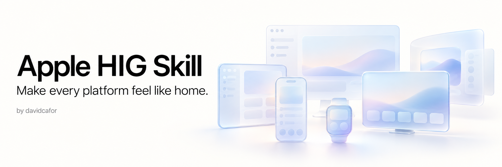

<div align="center">

# Apple HIG Skill

**Make every platform feel like home.**

An independent agent skill by [davidcafor](https://github.com/davidcafor), grounded in Apple's Human Interface Guidelines.

**iOS · iPadOS · macOS · watchOS · tvOS · visionOS**

[](#project-status)
[](LICENSE)
[](CONTRIBUTING.md)

</div>

---

## The idea

Good Apple software understands where it lives: the way people navigate, the space available, the controls they expect, and the ways they interact.

Apple HIG Skill helps an agent make those decisions deliberately, using Apple's design guidance as its source. It is an original project, with its own instructions, editorial approach, and roadmap.

## Project status

**Version 0.2.0 — expanded preview.**

The skill now contains actionable platform and component references, original SwiftUI examples, a dated official-source registry, and a behavioral evaluation suite. It supports real review and implementation work, while remaining a curated library rather than an exhaustive HIG audit or a certification of App Store approval.

| Area | Current coverage |
| --- | --- |
| iOS, iPadOS, macOS, watchOS, tvOS, visionOS | Separate platform references and validation questions |
| Components and flows | Navigation, tabs, sidebars, toolbars, search, windows, presentation, controls, settings, onboarding, loading, accounts, privacy |
| Accessibility and adaptation | Semantics, input, focus, text, contrast, motion, resizing, localization and RTL |
| System surfaces | Review guidance for widgets, complications, Live Activities, notifications and CarPlay |
| SwiftUI examples | Seven original examples; typechecked across their declared Apple SDK targets |
| Provenance | Exact official URLs, review dates and review scope |
| Behavioral evaluation | 24 cases with expected behaviors and false-positive controls; see actual execution status below |
| Runtime/device validation | Not yet performed for the sample interfaces |

See the [validation record](evals/RESULTS.md), [source registry](apple-hig-skill/references/sources.md), and [changelog](CHANGELOG.md). Compilation and structural checks do not establish interface quality on their own.

## Install

With [Node.js](https://nodejs.org/) installed, run this command from the project where you want to use the skill:

```sh
npx skills add davidcafor/apple-hig-skill --skill apple-hig-skill
```

The [Skills CLI](https://github.com/vercel-labs/skills) lets you select your coding agent and installation options. To make the skill available across projects, add `--global`:

```sh
npx skills add davidcafor/apple-hig-skill --skill apple-hig-skill --global
```

To inspect the available skill without installing it:

```sh
npx skills add davidcafor/apple-hig-skill --list
```

No npm package or account is required to publish this skill: the installer reads its `SKILL.md` and supporting files directly from this public GitHub repository. Installation does not imply complete HIG coverage.

For manual installation, copy the `apple-hig-skill/` directory into your agent's supported skills directory, preserving the included license and attribution files.

## Use with Claude Code

Install for Claude Code from your app's project directory:

```sh
npx skills add davidcafor/apple-hig-skill --skill apple-hig-skill --agent claude-code
```

Then type this **inside Claude Code**, not in your terminal shell:

```text
/apple-hig-skill Review this app's interface against Apple's HIG. Focus on navigation, layout and accessibility. Report findings with sources; do not edit files yet.
```

For a focused implementation task:

```text
/apple-hig-skill Improve SettingsView for macOS. Use native settings conventions, preserve the deployment target, and implement the changes. Explain the relevant HIG guidance and what you tested.
```

Claude Code exposes installed skills as `/skill-name` commands. See the [official skill documentation](https://code.claude.com/docs/en/skills).

## Use with Codex

Install for Codex from your app's project directory:

```sh
npx skills add davidcafor/apple-hig-skill --skill apple-hig-skill --agent codex
```

Then mention the skill **in the Codex prompt**:

```text
$apple-hig-skill Review this app's interface against Apple's HIG. Focus on navigation, layout and accessibility. Report findings with sources; do not edit files yet.
```

For a focused implementation task:

```text
$apple-hig-skill Adapt this screen for iPhone and iPad. Preserve access to essential actions at narrow widths, support larger text, and implement the changes using APIs available to this project.
```

In Codex CLI and the IDE extension, type `$` to select a skill or use `/skills`. If a newly installed skill does not appear, restart Codex. See the [official skill documentation](https://learn.chatgpt.com/docs/build-skills).

## More example prompts

Use `/apple-hig-skill` in Claude Code or `$apple-hig-skill` in Codex before any of these requests. You can write your request in your preferred language.

| Goal | Request |
| --- | --- |
| Review one file | Review SettingsView.swift for platform conventions and accessibility. Identify concrete problems and link each finding to Apple guidance. |
| Design a new feature | Plan a native search experience for iPhone, iPad and Mac. Explain navigation and presentation choices before implementation. |
| Check accessibility | Review labels, text scaling, focus order and reduced-motion behavior. Separate code findings from checks that need a running app. |
| Adapt to Apple Watch | Plan a brief watchOS interaction for this feature. Explain which content and actions should be prioritized. |
| Fix a known problem | Fix the clipped actions on this narrow iPad layout. Preserve the current deployment target and unrelated behavior. |

These examples show how to scope a request; they are not evidence that every resulting interface has been tested. Give the agent access to the relevant project files; screenshots can support visual review but cannot prove interaction or accessibility behavior.

## How it works

1. Identify the target platform, supported OS versions, input methods, and task.
2. Read the relevant platform guidance and component sources.
3. Separate Apple's explicit guidance from the project's implementation choices.
4. Propose focused changes with sources and a practical validation method.
5. Report what was verified and what still needs visual or device testing.

The skill uses original summaries and links to Apple documentation. It does not bundle Apple's manuals or design assets.

## What makes the skill useful

The entry point loads only the relevant platform and topic references. Reviews distinguish **Apple guidance**, **implementation interpretation**, and **needs verification**, with observable impact and focused corrections.

The skill explicitly avoids common overclaims: custom controls are not automatically wrong; a screenshot cannot prove VoiceOver support; one touch-target measurement does not apply to every Apple platform; the newest SDK does not make an API available on the oldest supported OS.

Browse the [skill entry point](apple-hig-skill/SKILL.md), [SwiftUI examples](apple-hig-skill/references/swiftui-implementation.md), and [evaluation protocol](evals/README.md).

## Roadmap toward a stable release

The remaining work is evidence-driven:

- Run the complete behavioral suite in both Claude Code and Codex, comparing the same tasks with and without the skill.
- Exercise the examples in running apps, including VoiceOver, larger text, keyboard/focus, resizing, and appropriate hardware inputs.
- Add realistic multi-file implementation fixtures and regression cases from actual use.
- Deepen specialist coverage as tested use cases justify it: media, games, HealthKit experiences, Wallet/Apple Pay, Pencil tools, advanced spatial interaction, and additional extensions.
- Revisit source guidance and API availability as Apple documentation evolves.

A stable release should demonstrate useful, source-supported findings and fewer avoidable mistakes. More rules alone do not establish that quality.

## Maintain and validate

Run structural checks with Python 3.9 or later:

```sh
python3 scripts/validate.py
```

On a Mac with full Xcode and the required SDKs installed:

```sh
DEVELOPER_DIR=/Applications/Xcode.app/Contents/Developer python3 scripts/typecheck_examples.py
```

The second command checks declared deployment targets without changing your global Xcode selection. It does not launch simulators or test interaction. Source-review dates are updated only after a substantive review, not merely a successful URL request.

## Build it together

Questions, corrections, examples, and platform expertise are welcome. Open an issue to discuss a proposal or a pull request for a focused change. Please include the official Apple source behind a design rule and describe how you checked it.

See [CONTRIBUTING.md](CONTRIBUTING.md). Contributions are reviewed by the maintainer before merging, and Git history preserves contributor credit.

## Authorship and license

Created and maintained by **[davidcafor](https://github.com/davidcafor)**.

Copyright © 2026 davidcafor and contributors. Original material in this repository is licensed under [Creative Commons Attribution 4.0 International](LICENSE).

You may share and adapt the material, including commercially, subject to the license. When sharing it or adaptations, give appropriate credit, link to the license, and indicate changes. Suggested attribution:

> Based on Apple HIG Skill by davidcafor — https://github.com/davidcafor/apple-hig-skill — CC BY 4.0. Changes: describe your modifications.

Merely using the skill as a tool does not require credit in an app you create. If you reproduce licensed repository material, the license applies to that material.

Apple and its platform names are trademarks of Apple Inc. This community project is not affiliated with or endorsed by Apple. Linked third-party material remains subject to its own terms.
